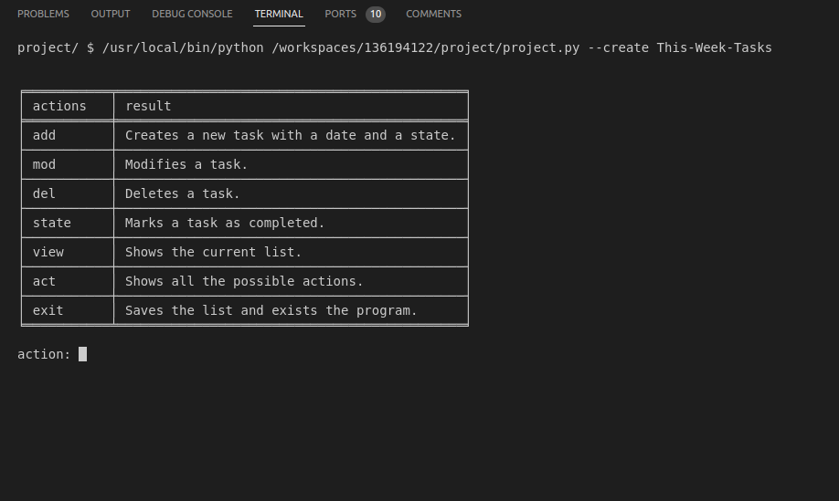

# Todo-List App

## Video Demo: <https://youtu.be/ax3WxqLjYq0?si=qeUNJyaZLfVt5Nks>

## Description:
Hello! This project consist of a simple Todo-List program to help you keep track of whatever you want to achieve daily, weekly or even monthly!

This is the first project that i make on my own so i'll try to explain it on detail.

## Walkthrough
In the execution of the program the user is given two options, either to create a new list using the argument "--create", plus a name for the list or load a saved list with the argument "--load", and the name of a file that exists in the same directory. independently of the choice made, the user can now look at a table with all the actions possible and enter one of them:

From this point forward the user can add, modify, delete or mark as complete all the task they want until they exit the program with the corresponding action.

And that is all! it is a pretty simple program.

## design
All of this is made using a csv file with the same name that the user wrote when creating the list, I choose to make the program this way so if the user wants to save the list for another day or if mistakenly exits the program, it doesn't have to start from the beginning.

Beside this, the program is made using only functions and nothing of OOP, i decided to make it this way because i felt more comfortable with it, but in the future it could be remade using classes intead.

## How the functions work

#### create
Uses the open function with "w" mode to create and write a file. Next, it writes in the first row: task, date and state. This three words will be used as keys for the other functions. Finally, calls the action function.

#### load
Opens a file on "r" mode and calls the action function.

#### add
Asks for a new task and a date in which the user thinks it should be finished, then, if both the task and date are valid, writes each value on its corresponding column and writes the value "unfinished" on the state column. This is made using the previously written values in the create function as keys for a DictWriter.

#### modify
First, it opens the file on read mode to get the length of the columns, then, asks the number of task we want to modify. If the number is valid(greater than zero but equal or lower than the length of the file), the program asks for a new task and date and then uses the number as an index in both columns to change them to the new ones.

#### delete
Similar to the modifiy function, it asks for the number of task we want to delete, if the number is valid, the program uses the number as an index and deletes that row completely.

#### view
It reads the content of the file and appends each row into a list, once it is done, uses that list as an argument for the tabulate function from the tabulate library and uses print to show the list.

#### state
Pretty much the same as modify. it asks for the number of task you completed, if the number is valid, changes the value of state in that row to "finished".

#### task_validation
If the number only contains letters,numbers and spaces returns Frue, else returns False.

#### date_validation
If the date given is written in the DD/MM/YYYY format and the year is greater than 2022, returns True, else returns False.

#### number_validation

If the number given is greater than the length of the file or lower than zero, it returns False, else returns True.